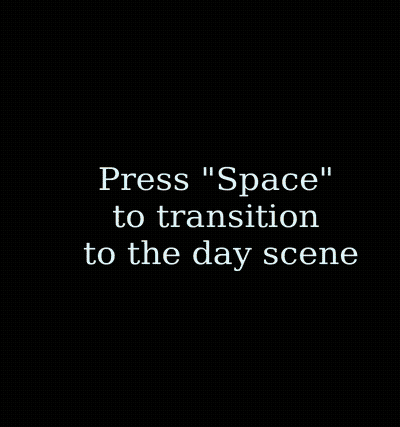
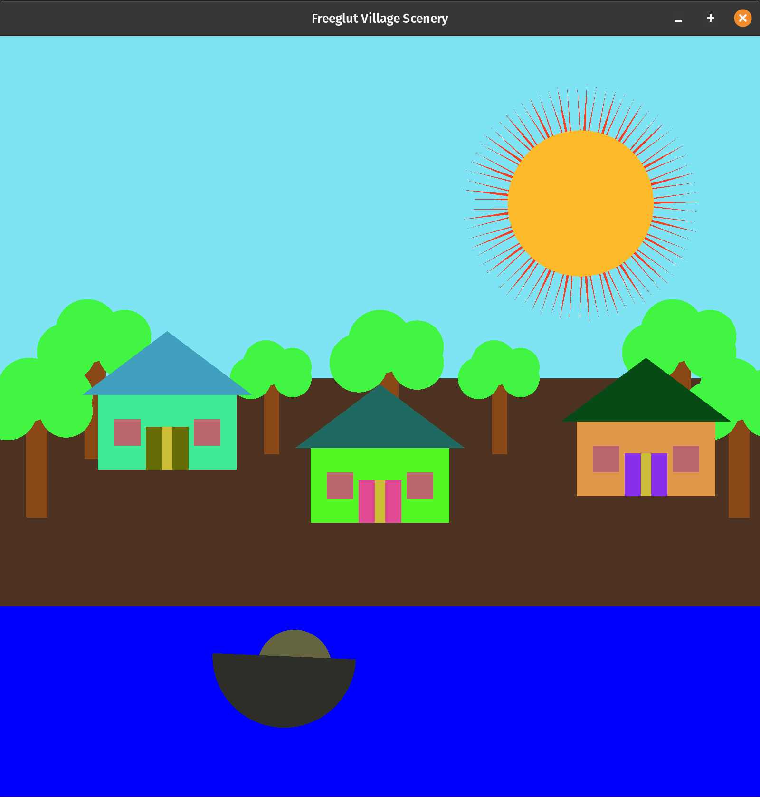
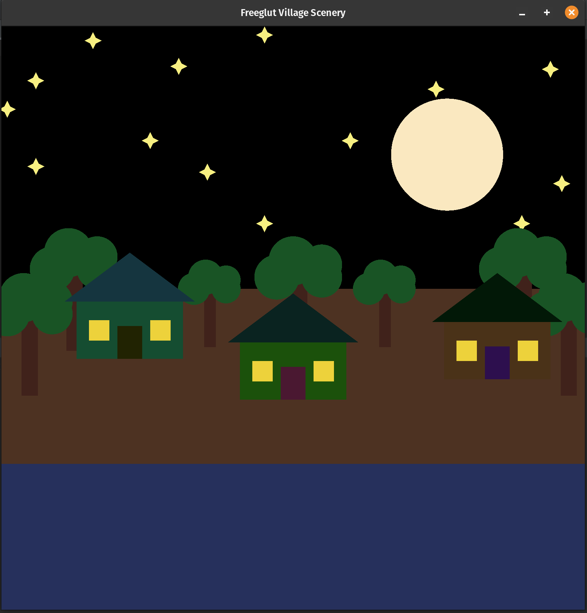

# About
The project is an extremely simple drawing of an imaginary village scene. The project demonstrates the transitions of various elements, and it was made for practice purposes only. The project may contain inefficient code as it was a practice project.
 

# Demo
<ul>
    <li>
      
 <h2>Demonstration (Please wait, It takes some time to load!)</h2> 

      
    </li>
    <li>
      
 <h2>Day</h2>

      
    </li>
    <li>
      
 <h2>Night</h2> 

      
    </li>
</ul> 

# Features

<ul>
    <li>Transition between day and night. The transition happens gradually. View the above demostration.</li>
    <li>Doors will shut at night, and house lights will be turned on.</li>
    <li>The boat moves in a wavelike pattern.</li>
    <li>The colors of every element are adjusted (dimmed or brightened) according to day or night.</li>
</ul> 

# Setup

<ol>
    <li> Clone or Download this Repository. </li>
    <li> Run the below commands to setup Freeglut in Ubuntu (22),
        <ul>
            <li>sudo apt update</li> 
            <li>sudo apt install build-essential</li>
            <li>sudo apt install cmake</li> 
            <li>sudo apt install freeglut3 freeglut3-dev libgl1-mesa-glx</li> 
        </ul>
    </li>
    <li> Open the directory in <a href="https://www.jetbrains.com/clion/">CLion</a> (IDE).  </li>
    <li>Build and run the project.</li>
</ol> 
